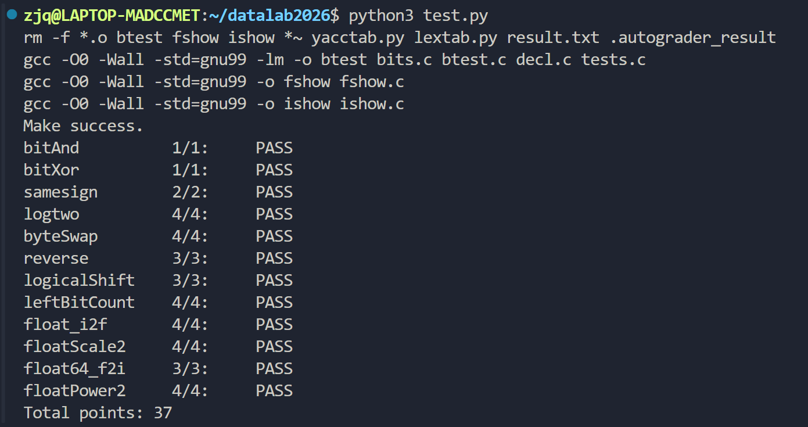

# DataLab 实验报告

姓名：赵嘉祺

学号：2025201797

## 实验结果

| 总分 | bitAnd | bitXor | samesign | logtwo | byteSwap | reverse | logicalShift | leftBitCount | float_i2f | floatScale2 | float64_f2i | floatPower2 |
| ---: | ---: | ---: | ---: | ---: | ---: | ---: | ---: | ---: | ---: | ---: | ---: | ---: |
| 37 | 1 | 1 | 2 | 4 | 4 | 3 | 3 | 4 | 4 | 4 | 3 | 4 |

## 测试截图



## 亮点

- `float_i2f`：根据最高位确定指数，并处理尾数截取和舍入到偶数。
- `reverse`：通过分组交换依次反转 16 位、8 位、4 位、2 位和 1 位。
- `leftBitCount`：将连续前导 1 转换为连续前导 0，再用二分方法统计数量。

## 解题报告

### bitAnd

利用德摩根定律：

```text
x & y = ~(~x | ~y)
```

因此只使用 `~` 和 `|` 实现按位与。

### bitXor

利用异或的等价表达式：

```text
x ^ y = ~(x & y) & ~(~x & ~y)
```

该实现只使用题目允许的 `~` 和 `&`。

### samesign

通过 `x ^ y` 判断两个整数的符号位是否相同，再单独处理 0 的情况，使 0 只与 0 判定为同号。

### logtwo

通过二分方式依次判断最高位是否位于高 16 位、高 8 位、高 4 位、高 2 位和最后 1 位，从而得到正整数的二进制对数。

### byteSwap

先计算两个目标字节的位置，取出两个字节的差异，再将差异移回两个位置并与原数异或，实现字节交换。

### reverse

依次交换 16 位、8 位、4 位、2 位和相邻的 1 位，实现 32 位整数的整体位反转。

### logicalShift

先进行算术右移，再构造掩码清除右移时补到高位的符号位，从而得到逻辑右移结果。

### leftBitCount

将输入取反，把统计最高位连续 1 的问题转换为统计最高位连续 0，再使用二分移位的方法统计连续位数。

### float_i2f

提取整数的符号位，找到最高位 1 确定指数，提取尾数，并按照 IEEE 754 规则处理舍入。

### floatScale2

根据指数部分判断 NaN、无穷大、非规格化数和规格化数，分别处理，实现浮点数乘 2。

### float64_f2i

提取双精度浮点数的符号、指数和尾数，根据指数范围判断下溢和溢出，再将尾数移位转换为整数。

### floatPower2

根据指数范围分别处理下溢、非规格化数、规格化数和上溢，返回 `2^x` 的 IEEE 754 位表示。

## 总结

本实验加深了我对补码、位运算和 IEEE 754 浮点数表示的理解。我认识到实现过程中需要同时关注功能正确性、允许使用的操作符以及最大操作数限制。最终所有测试通过，总分为 37 分。

## 参考资料

- 课程提供的 DataLab 实验说明与代码注释。
- IEEE 754 单精度和双精度浮点数格式说明。
